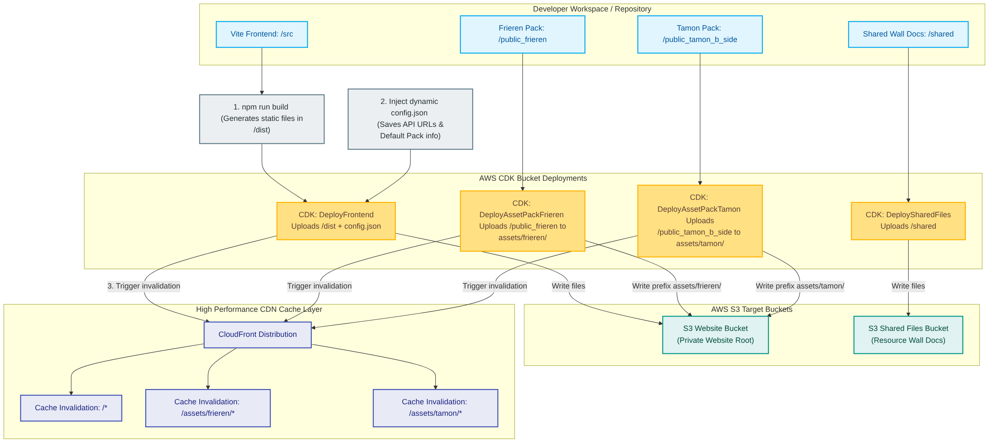
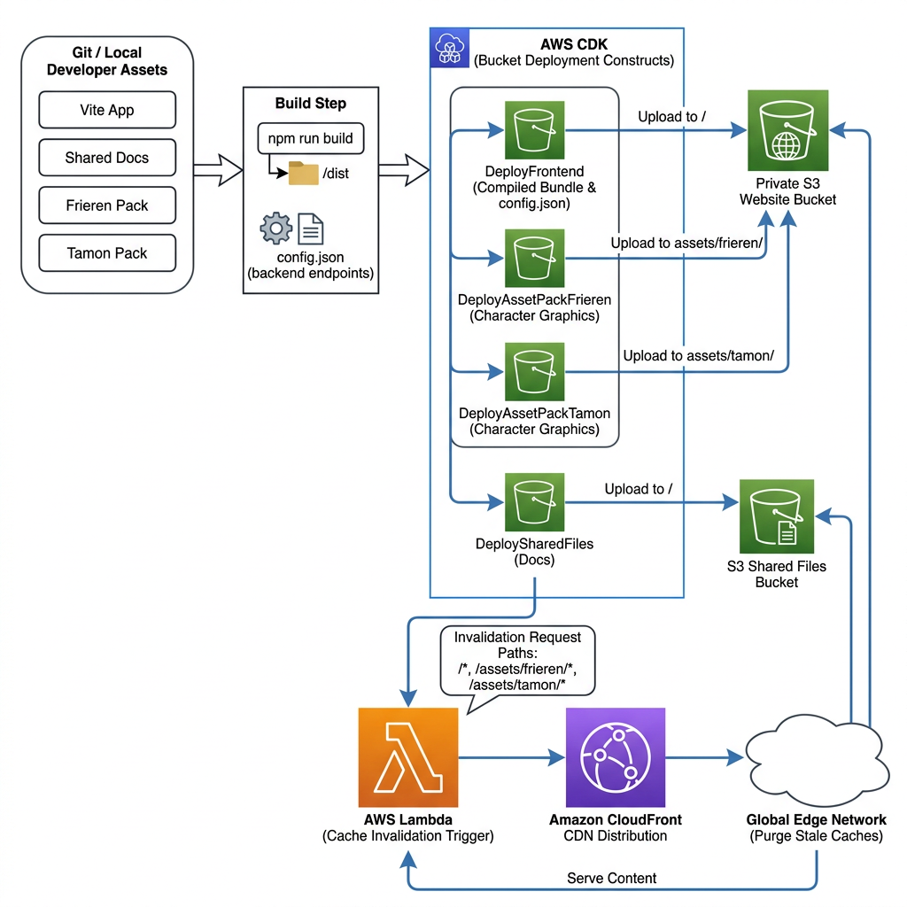

# Frontend Assets & Theme Packs Deployment Design

## Architectural Flow Diagrams

### Standard System Flowchart


### AWS-Style Enterprise Blueprint


This document details the deployment architecture of the **OpenClaw Character Dashboard** frontend assets, highlighting the Vite build process, dynamic JSON configuration injection, character asset packs, and CloudFront edge CDN cache invalidations.

---

## 1. Dynamic Client-Side Configurations

In traditional static page deployments, hardcoding backend API or WebSocket endpoints into production builds makes code highly fragile and environment-dependent. 

OpenClaw solves this by dynamically generating client configurations at deployment time:

1.  **CDK Compilation**: The CDK stack compiles Vite source assets into standard static files inside the local `/dist` folder.
2.  **Configuration Generation**: During stack synthesis, CDK computes the actual distribution endpoint addresses of the deployed CloudFront and WebSocket API Gateway resources.
3.  **JSON Injection**: The `DeployFrontend` bucket deployment generates a virtual JSON asset called `config.json` containing the live REST and WebSocket endpoints:
    ```json
    {
      "apiBaseUrl": "https://{cloudfront-domain}/api",
      "webSocketUrl": "wss://{api-id}.execute-api.{region}.amazonaws.com/prod",
      "availableAssetPacks": ["frieren", "tamon"],
      "defaultAssetPack": "frieren"
    }
    ```
4.  **S3 Deploy**: This JSON is uploaded directly alongside the main bundle to the S3 website bucket. When the user loads the dashboard, the React frontend dynamically fetches `/config.json` first, resolving target endpoints on-the-fly.

---

## 2. Character Asset Packs Partitioning

The dashboard supports custom interactive character assets (voice, animated sprites, custom themes). Because these rich graphic assets (Frieren and Tamon packs) are large, they are decoupled from the core application build:

*   **Prefix Isolation**: Rather than including assets inside the main React package, asset packs are stored in standalone folders (`public_frieren/`, `public_tamon_b_side/`).
*   **Decoupled S3 Targets**: CDK's S3 Bucket Deployments deploy these packs under distinct S3 subfolders inside the website bucket:
    *   `/assets/frieren/`
    *   `/assets/tamon/`
*   **On-Demand Ingestion**: This isolation keeps the core application extremely lightweight (under 1MB). Large character graphic and audio files are fetched asynchronously by the client browser only when that specific character theme is activated by the user.

---

## 3. CDN Cache Invalidation

Deployments to AWS S3 are fast, but because CloudFront aggressively caches static assets at Edge Locations to maintain high global load performance, clients would normally continue seeing stale cached files after a deployment.

To resolve this, the CDK bucket deployment automatically triggers an edge cache invalidation:

*   **Automatic Trigger**: When CDK detects content changes during deployment, it runs a post-deployment Lambda execution.
*   **Target Invalidations**: The Lambda sends an invalidation request to the CloudFront distribution targeting the paths `/*`, `/assets/frieren/*`, and `/assets/tamon/*`.
*   **Immediate Availability**: Stale edge cache items are instantly purged, forcing CloudFront to fetch fresh new application packages from the S3 origin bucket on the next client request.
