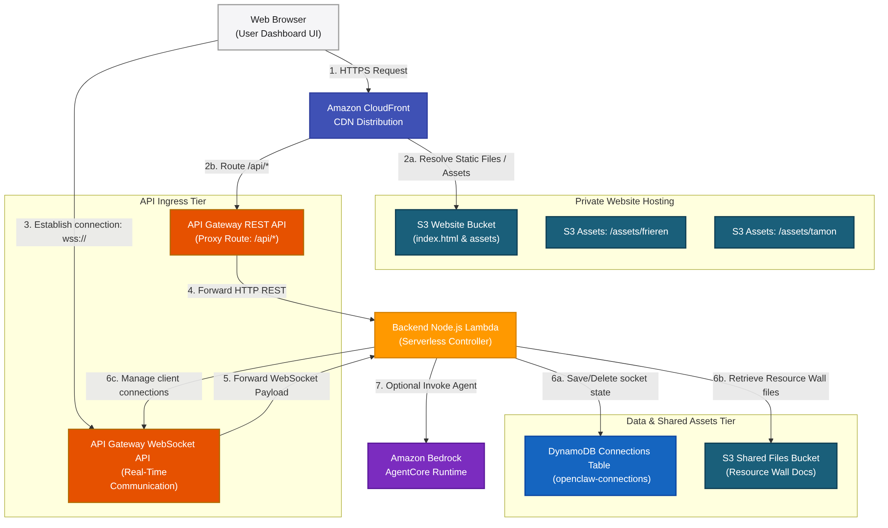
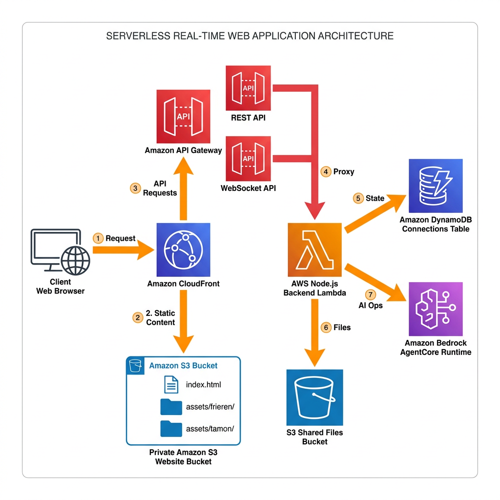

# OpenClaw Character Dashboard: System Design Overview

## Technical Architecture Diagrams

### Standard System Topology

### AWS-Style Enterprise Blueprint

This document details the comprehensive system architecture design for the **OpenClaw Character Dashboard**, a premium, serverless real-time web application deployed on AWS.

The solution serves as an interactive frontend management console and chat center for OpenClaw. It integrates custom character themes (e.g., "Frieren", "Tamon") and implements dual HTTP/WebSocket protocol layers to stream low-latency updates from Amazon Bedrock AgentCore runtime models directly to user browsers.

---

## 1. Core Architectural Pillars

The character dashboard architecture is structured around five primary technical pillars:

1.  **High-Performance Static CDN Edge**:
    Serves Vite React static assets (HTML, JS, CSS) from a private, block-public-access S3 website bucket. Security is enforced by routing all ingress static file traffic through an **Amazon CloudFront Distribution** using an Origin Access Identity (OAI), achieving secure, sub-second content loads globally.

2.  **Dual-Protocol API Ingress Layer**:
    Leverages Amazon API Gateway to expose two serverless ingress endpoints:
    *   **REST API Gateway**: Proxy-routes HTTP `/api/*` requests for synchronous actions (configuration settings, static health probes).
    *   **WebSocket API Gateway**: Manages stateful, persistent, two-way WebSocket connections to push model reasoning text and audio streams in real-time.

3.  **Unified Node.js Backend Controller**:
    Consolidates API processing within a single, highly optimized, serverless **Backend Lambda** function built on Node.js 20.x. This function handles REST API requests, WebSocket routes (`$connect`, `$default`, `$disconnect`), and directly manages connections via AWS's WebSocket client connection manager.

4.  **Real-Time State Store**:
    Uses an **Amazon DynamoDB Table** (`OpenClawDashboardConnections`) with single-table design to record active WebSocket socket IDs and active session states. Since Lambda is serverless, storing socket mapping in DynamoDB allows on-demand message routing to specific browsers.

5.  **Multi-Tenant Theme Asset Customization**:
    Integrates theme asset packs (e.g., Frieren, Tamon) uploaded under distinct directory prefixes inside the S3 website bucket. Dynamic frontends load these on-demand, enabling immediate interface updates without redeploying the main application core.

---

## 2. Infrastructure Stack Deployment

The AWS CDK application, defined in `infra/dashboard-stack.ts`, provisions the entire environment serverless stack in a single deployment:

*   **Website Bucket**: Block-public-access S3 website bucket with CloudFront OAI read permissions.
*   **Shared Files Bucket**: S3 bucket for "Resource Wall" files with permissive CORS configs for direct client fetches.
*   **DynamoDB Connections Table**: Pay-per-request Table (`OpenClawDashboardConnections`) for socket state.
*   **REST & WebSocket APIs**: Integrates API Gateway REST and WebSocket configurations with the Backend Lambda handler.
*   **Node.js Backend Lambda**: Node.js 20 Lambda with appropriate IAM policy statements to invoke Amazon Bedrock runtime endpoints.
*   **CDN Distribution**: Configures CloudFront CDN routing with a default S3 behavior and a `/api/*` rest API gateway origin proxy behavior.
*   **Bucket Deployments**: Compiles code, injects dynamic endpoint variables into `config.json`, uploads static assets, and invalidates CloudFront edge caches.
