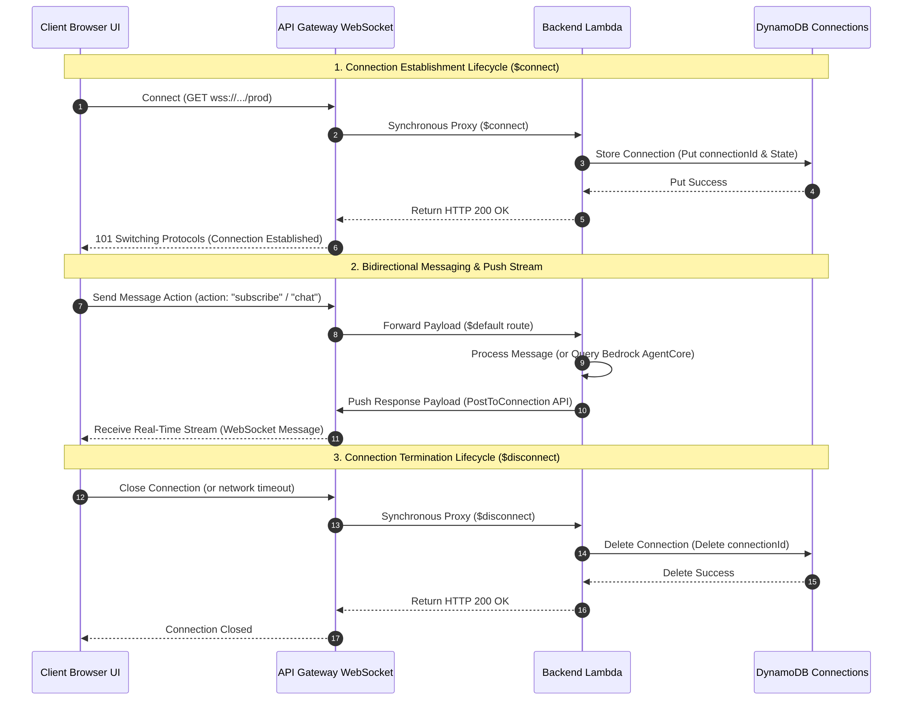
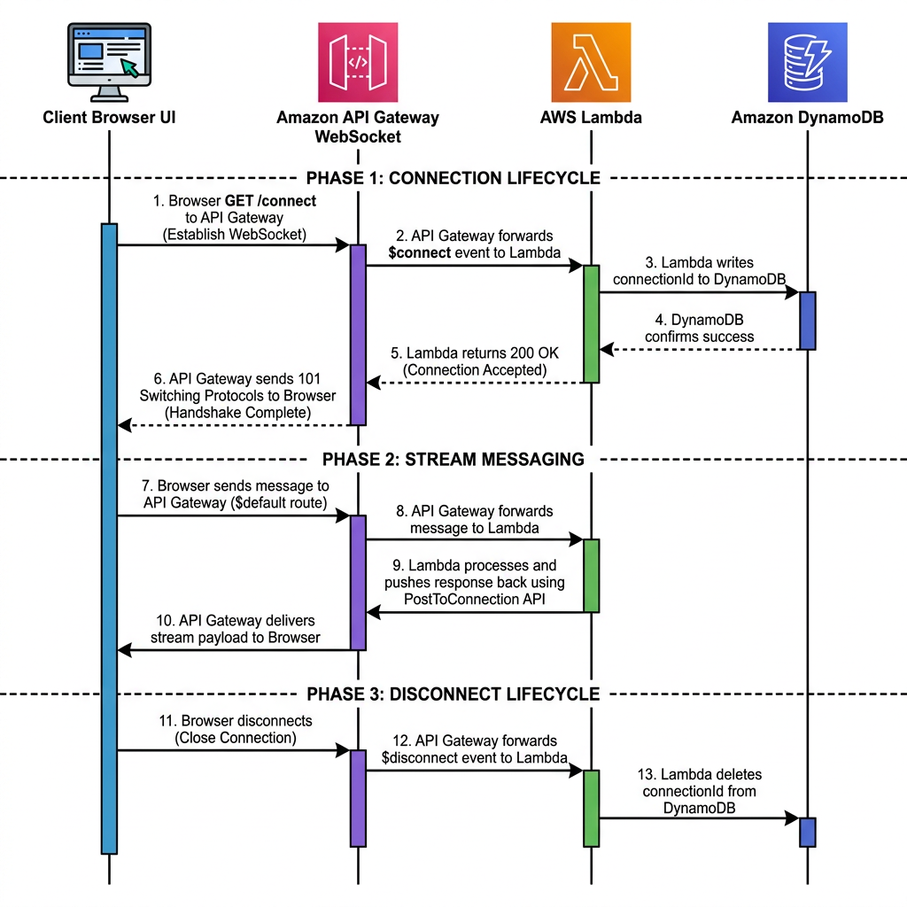

# WebSocket Connection Lifecycle Specification

## Architectural Sequence Diagrams

### Standard Sequence Flowchart

### AWS-Style Enterprise Blueprint

This document details the architectural specifications of the stateful real-time communication pipeline utilized by the OpenClaw Character Dashboard. Dual-way persistence is managed by combining **API Gateway WebSocket APIs**, **AWS Lambda**, and **Amazon DynamoDB**.

---

## 1. Connection Establishment ($connect)

When a user opens the Character Dashboard in their browser:

1.  **Handshake**: The client initiates a standard WebSocket handshake pointing to API Gateway's production WebSocket URL (`wss://{api-id}.execute-api.{region}.amazonaws.com/prod`).
2.  **API Gateway Routing**: API Gateway intercepts the `$connect` route request and proxies it synchronously to the Node.js **Backend Lambda**.
3.  **State Persistent Write**: The Backend Lambda extracts the unique connection ID (`connectionId`) from the event context and performs a synchronous `PutItem` write operation into the DynamoDB `OpenClawDashboardConnections` table, storing the client's connectivity and session state metadata.
4.  **Acknowledgment**: Upon successful DynamoDB write, the Lambda returns an HTTP `200 OK` response. API Gateway upgrades the HTTP connection to WebSocket (`101 Switching Protocols`), and the persistent socket tunnel is successfully established.

---

## 2. Active Communication and Post-To-Connection

While the connection remains active, communication flows bidirectionally:

1.  **Client-to-Server Requests**:
    *   The browser client sends structured JSON actions (e.g., `{ "action": "chat", "message": "hello frieren" }`) through the WebSocket.
    *   API Gateway processes this through its `$default` route, invoking the Backend Lambda with the socket body.
2.  **Server-to-Client Serverless Streams**:
    *   Because Lambda is serverless and ephemeral, it cannot hold TCP connections open directly.
    *   To push real-time responses (e.g., chunked token streams from an Amazon Bedrock AgentCore invocation), the Lambda invokes API Gateway's management endpoint via the **`execute-api:ManageConnections`** permission.
    *   Lambda posts messages directly to `https://{api-id}.execute-api.{region}.amazonaws.com/prod/@connections/{connectionId}`. API Gateway handles the actual physical packet delivery down the WebSocket tunnel to the user's browser.

---

## 3. Disconnection Lifecycle ($disconnect)

To ensure the system remains completely garbage-collected and avoids stale socket tracking:

1.  **Connection Closure**: When the client closes the browser tab, or network coverage is dropped, a client-closed event triggers.
2.  **Tear-Down Event**: API Gateway detects the closed connection and fires a synchronous `$disconnect` event to the Backend Lambda.
3.  **State Deletion**: The Lambda executes a `DeleteItem` request targeting the DynamoDB table to clean up the inactive `connectionId` mapping.
4.  **Resource Cleanup**: Stale connection entries are immediately purged from database storage, maintaining a clean, accurate index of online users.
