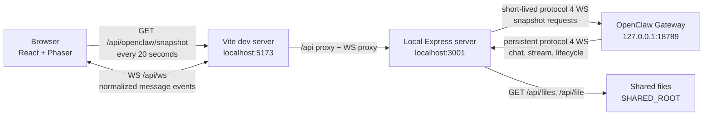

# Local OpenClaw Dashboard Integration

The dashboard uses two local data paths:

1. **Snapshot polling** determines whether each character is `working` or `idle`.
2. **WebSocket events** display user and assistant messages in scrolling speech bubbles.

The browser never connects directly to the OpenClaw Gateway and never receives the gateway token.
The local Express server reads the token from `<OPENCLAW_HOME>/openclaw.json` and acts as the
gateway client.

## Architecture



In a production build served by Express, the browser connects directly to the same Express process;
the Vite proxy is only part of development.

## Runtime configuration

| Variable                           | Purpose                                    | Default                  |
| ---------------------------------- | ------------------------------------------ | ------------------------ |
| `OPENCLAW_HOME`                    | Directory containing `openclaw.json`       | `~/.openclaw`            |
| `VITE_API_PORT`                    | Express port and Vite `/api` proxy target  | `3001`                   |
| `SHARED_ROOT`                      | Resource-wall file root                    | `<OPENCLAW_HOME>/shared` |
| `VITE_PUBLIC_DIR`                  | Asset pack containing `world.json`         | `public`                 |
| `VITE_SESSION_ACTIVE_THRESHOLD_MS` | Recent activity window for `working` state | `10000`                  |

The gateway port and token come from:

```json
{
  "gateway": {
    "port": 18789,
    "auth": {
      "token": "<local gateway token>"
    }
  }
}
```

## Snapshot state flow

`LiveDataSource` requests `/api/openclaw/snapshot` immediately and then every 20 seconds. For each
request, Express:

1. Opens a short-lived WebSocket to the local gateway.
2. Completes the protocol 4 `connect.challenge` handshake as an `operator.read` backend client.
3. Requests `agents.list`, `sessions.list`, and `system-presence`.
4. Requests `agent.identity.get` for each configured agent.
5. Returns the combined snapshot and closes the gateway connection.

The browser groups session records by the agent ID in keys such as `agent:main:main`. A character is
`working` when it has a user-facing session that is active or was updated within
`VITE_SESSION_ACTIVE_THRESHOLD_MS`. Heartbeat sessions are ignored. All other characters are
`idle`.

## Live message flow

When the Express server starts, `GatewayEventMonitor` opens a persistent protocol 4 WebSocket to the
gateway. It normalizes gateway events before broadcasting them to browser clients connected at
`/api/ws`.

| Dashboard event       | Source                              | Browser behavior                                         |
| --------------------- | ----------------------------------- | -------------------------------------------------------- |
| `agent-message`       | Complete chat message               | Replace the current message for the run and role         |
| `agent-stream`        | Incremental stream chunk            | Append only when the run and role still match            |
| `agent-message-final` | Final, error, or aborted chat state | Mark the matching message complete                       |
| `agent-lifecycle`     | Agent phase event                   | Mark matching `end`, `error`, or `aborted` runs complete |

Events carry `runId` and `agentId`. If an event omits `agentId`, the browser maps it to the `main`
agent. Completion from an older run cannot finish or remove a newer run's message.

Speech bubbles do not use a fixed deletion timeout. They remain visible while a run is streaming,
scroll long content at a fixed rate, hold the final lines, and then remove only the exact message
that finished playback.

## Browser WebSocket lifecycle

The browser connects to the same origin at `/api/ws`:

```text
http://dashboard.example  -> ws://dashboard.example/api/ws
https://dashboard.example -> wss://dashboard.example/api/ws
```

The connection automatically retries after five seconds following an unexpected close. It closes
while the tab is hidden and reconnects when the tab becomes visible again. Closing the browser or
stopping the page therefore closes the browser-side dashboard WebSocket; the local server's gateway
monitor continues running until the server process stops.

## Resource wall

The local server exposes files below `SHARED_ROOT`:

| Endpoint                              | Purpose                    |
| ------------------------------------- | -------------------------- |
| `GET /api/files?path=<relative-path>` | List a directory           |
| `GET /api/file?path=<relative-path>`  | Preview or download a file |

Paths are sanitized and resolved below the configured root. These local endpoints do not implement
cloud authentication; run the dashboard only on a trusted machine or trusted local network.

## Failure behavior

- Invalid `world.json` data is surfaced as a fatal UI error.
- Snapshot failures set live-data status to error and retry on the next poll.
- Gateway and dashboard WebSockets log errors and reconnect automatically.
- Invalid or unmapped live events are logged instead of silently creating incorrect character data.
- The UI can switch to mock mode when live OpenClaw data is not needed.
